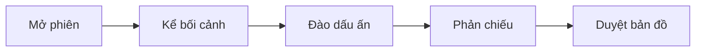

# EXPERTPRINT — SESSION 1 UI/UX SPEC

## 1. Mục tiêu trải nghiệm

Session 1 không phải form khảo sát và cũng không phải màn chat kéo dài. Đây là một **guided discovery experience** giúp CEO/chuyên gia nhận ra bằng chứng về năng lực của chính mình và kết thúc bằng một tài sản thương hiệu có thể duyệt.

Kết quả đầu ra bắt buộc:

- 3 thế mạnh cốt lõi, mỗi thế mạnh có bằng chứng từ câu chuyện thật.
- 1 `Growth Edge` — điều đang hạn chế việc biến chuyên môn thành ảnh hưởng/cơ hội.
- 1 `Content Compass` — các chủ đề và góc nhìn người dùng có quyền lên tiếng.
- Phân loại từng kết luận thành `fact`, `belief` hoặc `hypothesis`.
- Chỉ lưu vào Brand Memory sau khi người dùng sửa và duyệt.

## 2. Vấn đề của giao diện hiện tại

1. Header có quá nhiều pill, biểu tượng và hai lớp điều hướng, làm trải nghiệm giống dashboard công cụ.
2. Cụm từ `Buổi coach 1:1 tiêu chuẩn ICF` dễ tạo cảm giác đây là dịch vụ coaching/booking và là một tuyên bố tiêu chuẩn chưa được chứng minh.
3. Badge `Bảo mật tuyệt đối` là lời hứa quá mức. Cần thể hiện quyền kiểm soát dữ liệu cụ thể thay cho claim tuyệt đối.
4. Bubble chat quá lớn, nội dung AI dài, người dùng phải cuộn nhiều và khó biết đang cần trả lời điều gì.
5. OTP, liveness và deepfake protection đang xuất hiện sai thời điểm. Chúng chỉ cần ở bước nhân bản voice/likeness, không thuộc khám phá thế mạnh.
6. Sáu pha nội bộ và năm bước sản phẩm cùng xuất hiện sẽ làm người mới nhầm lẫn.
7. Giao diện đang dùng coral/heart như một app wellbeing; chưa thể hiện đủ chất premium, chuyên môn và dấu vân tay riêng.

## 3. Mô hình trải nghiệm mới

Người dùng chỉ thấy năm chặng bằng ngôn ngữ đời thường:

1. **Bối cảnh của bạn** — đang làm gì, vì sao xây thương hiệu lúc này.
2. **Dấu ấn đã tạo ra** — một kết quả thật mà họ tự hào.
3. **Năng lực đứng sau kết quả** — cách nghĩ, cách làm, cách huy động nguồn lực.
4. **Điểm chưa được nhìn thấy** — năng lực chưa được gọi tên hoặc rào cản đang giữ họ lại.
5. **Bản đồ dấu ấn** — 3 thế mạnh, Growth Edge và Content Compass.

Không hiển thị nhãn `Pha 0–5`, `limiting beliefs` hoặc thuật ngữ ICF trong UI. Có thể giữ methodology trong logic nội bộ và tài liệu quản trị.

## 4. Cấu trúc màn hình desktop

Giữ sidebar toàn app với năm khu vực đã khóa. Không tạo top navigation riêng cho Session 1.

Main canvas rộng tối đa `1120px`, chia hai vùng:

- **Conversation canvas 720px:** câu hỏi, phản chiếu, input.
- **Session rail 280px:** tiến độ, dữ liệu đã được nhận diện và quyền riêng tư. Rail sticky nhưng không cạnh tranh với câu hỏi chính.

Header trong main canvas cao khoảng `72px`:

- Eyebrow: `THƯƠNG HIỆU CỦA TÔI · KHÁM PHÁ 01`.
- Title ngắn: `Thế mạnh tạo nên dấu ấn`.
- Bên phải: `Đã lưu` và menu `Thoát & tiếp tục sau`.

Không hiển thị email đầy đủ trong header. Avatar/menu tài khoản thuộc app shell.

## 5. Màn mở đầu — trang art có chủ đích

Màn đầu được phép giàu hình ảnh hơn các màn thao tác:

- Một motif vân tay liền nét cỡ lớn, crop tự do ở 35–45% chiều rộng, nét ink/cobalt trên nền optical white.
- Headline Didone 48–64px: **“Điều gì khiến cách làm của bạn khác biệt?”**
- Body sans-serif: `Hãy kể bằng trải nghiệm thật. Dấu Ấn Studio sẽ giúp bạn nhìn ra năng lực đứng sau những kết quả đó.`
- Meta nhỏ: `Khoảng 8–12 phút · Có thể dừng và tiếp tục`.
- Primary CTA cobalt: `Bắt đầu khám phá`.
- Secondary CTA: `Dùng tài liệu có sẵn`.
- Privacy link: `Dữ liệu này được dùng thế nào?` mở modal giải thích ngắn, không dùng badge “bảo mật tuyệt đối”.

`Dùng tài liệu có sẵn` mở bottom sheet/modal cho phép dán LinkedIn, bài viết, CV hoặc upload tài liệu. AI chỉ tạo giả thuyết; vẫn phải hỏi người dùng xác nhận.

## 6. Conversation canvas — một câu hỏi tại một thời điểm

### 6.1 Active question

- Chỉ một câu hỏi active trong viewport.
- Label nhỏ dùng fingerprint icon: `EXPERTPRINT ĐANG PHẢN CHIẾU`.
- Câu hỏi quan trọng dùng Didone 30–38px, tối đa 2–3 dòng.
- Một helper sentence sans-serif tối đa 120 ký tự.
- Không đặt mỗi lời AI trong card trắng lớn. Dùng khoảng trắng và một đường phân cách mảnh.

### 6.2 Reflection block

Sau khi người dùng trả lời, AI phản chiếu trong tối đa 2–3 câu:

- Trích một cụm từ chính xác của người dùng trong dấu ngoặc kép.
- Nêu một pattern đang nhận thấy dưới dạng giả thuyết.
- Hỏi một câu đào sâu duy nhất.

Thêm ba quick actions:

- `Đúng với tôi`.
- `Chưa đúng ý`.
- `Đào sâu thêm`.

Không tự động biến phản chiếu thành sự thật chỉ vì người dùng bấm tiếp.

### 6.3 Composer sticky

Composer bám đáy main canvas, nền white, border silver, radius 18px:

- Placeholder theo ngữ cảnh: `Kể lại một tình huống cụ thể…`.
- Text area tự giãn tối đa 6 dòng.
- Actions: `Thu âm`, `Đính kèm`, `Gửi`.
- Voice chỉ là phương thức nhập liệu. Không yêu cầu liveness/OTP ở Session 1.
- Có link `Tôi chưa nghĩ ra` để AI chia câu hỏi thành gợi ý nhỏ.
- Có `Bỏ qua lúc này`, nhưng giải thích ảnh hưởng đến độ chắc chắn của kết quả.

### 6.4 History

Các lượt trước thu gọn thành timeline nhẹ: số câu, một dòng tóm tắt và trạng thái. Chỉ mở toàn bộ khi người dùng bấm. Không dựng màn hình như transcript chat liên tục.

## 7. Session rail

Rail chỉ gồm ba card mảnh:

1. **Tiến độ**: `Đang khám phá dấu ấn · khoảng 6 phút còn lại`; không dùng tỷ lệ phần trăm giả khi số câu hỏi là dynamic.
2. **Điều đang nổi lên**: tối đa ba signal dạng chip như `Tư duy hệ thống`, `Kết nối nguồn lực`; luôn gắn `Đang kiểm chứng` cho đến khi duyệt.
3. **Quyền kiểm soát**: `Chỉ bạn thấy bản nháp này` + link `Quản lý dữ liệu`.

Không dùng `Bảo mật tuyệt đối`. Không hiển thị thuật ngữ kỹ thuật về encryption, deepfake hay OTP tại đây.

## 8. Màn kết quả — “Bản đồ dấu ấn của bạn”

Đây là trang art/milestone thứ hai của Session 1.

Hero:

- Eyebrow: `BẢN ĐỒ DẤU ẤN · BẢN NHÁP 01`.
- Headline Didone: `Ba năng lực thị trường nên nhớ về bạn.`
- Vân tay liền nét được tạo từ ba đường/chuyển động thị giác tượng trưng cho ba thế mạnh; không biến thành icon bảo mật.

Mỗi Strength Card gồm:

- Tên thế mạnh bằng ngôn ngữ có giá trị với thị trường, không dùng tính từ chung chung.
- Một câu giải thích `Bạn tạo giá trị bằng cách…`.
- `Bằng chứng từ câu chuyện của bạn` — quote hoặc dữ kiện gốc.
- Confidence: `Đã có bằng chứng`, `Cần thêm ví dụ` hoặc `Đang là giả thuyết`.
- Actions: `Đúng với tôi`, `Sửa cách gọi`, `Chưa đủ bằng chứng`.

Ví dụ cách đặt tên tốt:

- Không dùng: `Giao tiếp tốt`.
- Nên dùng: `Kết nối đúng nguồn lực để chiến lược được thực thi`.

Bên dưới ba thế mạnh:

- **Growth Edge:** trình bày như vùng phát triển, không phán xét điểm yếu.
- **Content Compass:** 3–5 lãnh địa nội dung; mỗi lãnh địa có `góc nhìn riêng`, `bằng chứng có thể kể`, `đối tượng được phục vụ`.
- CTA chính: `Duyệt & lưu vào thương hiệu của tôi`.
- CTA phụ: `Tiếp tục làm rõ`.

Khi người dùng duyệt, lưu đúng version vào Brand Memory. Mọi strength/claim chưa có bằng chứng phải giữ trạng thái hypothesis, không trở thành approved claim.

## 9. Copy thay thế trực tiếp

| Hiện tại | Thay bằng |
| --- | --- |
| `Studio 5 Bước` | Dùng app shell và tên thương hiệu; không tạo tên module phụ |
| `Hiểu Mình` | `Khám phá dấu ấn` |
| `Buổi coach 1:1 tiêu chuẩn ICF` | `Phiên khám phá có hướng dẫn · Bước 1/5` |
| `Coach AI` | `Dấu Ấn` hoặc `Phản chiếu từ Dấu Ấn` |
| `Bảo mật tuyệt đối` | `Riêng tư & do bạn kiểm soát` |
| `Mọi câu trả lời đều đúng` | `Không cần trả lời hoàn hảo. Hãy kể điều đã thật sự xảy ra.` |
| `Bạn đang làm gì, có bao nhiêu năm kinh nghiệm…` | `Điều gì khiến bạn muốn thị trường hiểu rõ hơn về mình vào lúc này?` |
| `Thách thức niềm tin` | `Điểm đang giữ bạn lại` |
| `Điểm mù` | `Điều bạn có thể chưa nhìn thấy` |

## 10. Visual tokens và component rules

- Typography bắt buộc cho toàn bộ Session 1 và được kế thừa từ design system toàn app:
  - **Editorial/display:** `Playfair Display`, weights 400/500. Font này hỗ trợ đầy đủ bộ ký tự tiếng Việt và giữ tinh thần high-contrast editorial gần định hướng Zara mà không sao chép nhận diện Zara.
  - **UI/body:** `Be Vietnam Pro`, weights 400/500. Dùng cho navigation, body, label, input, button, trạng thái và dữ liệu.
  - CSS import chuẩn: `https://fonts.googleapis.com/css2?family=Be+Vietnam+Pro:wght@400;500&family=Playfair+Display:wght@400;500&display=swap&subset=vietnamese`.
  - Font stack: `'Playfair Display', Georgia, serif` và `'Be Vietnam Pro', Arial, sans-serif`.
  - Không dùng `Italiana`, `Bodoni Moda` hoặc font display chưa kiểm tra đủ glyph tiếng Việt; không để trình duyệt tự fallback riêng từng ký tự vì sẽ làm chữ lệch nét, dấu và chiều cao.
  - Heading tiếng Việt dùng line-height tối thiểu `1.08`; câu hỏi dài dùng `1.15`; body dùng `1.5–1.65` để dấu trên/dưới không bị cắt.
  - Chỉ dùng weight 400 và 500; không giả lập bold bằng trình duyệt.
  - Trước release phải test chuỗi: `ă â đ ê ô ơ ư — ạ ả ấ ầ ẩ ẫ ậ ắ ằ ẳ ẵ ặ ẹ ẻ ẽ ế ề ể ễ ệ ị ỉ ọ ỏ ố ồ ổ ỗ ộ ớ ờ ở ỡ ợ ụ ủ ũ ứ ừ ử ữ ự ỳ ý ỷ ỹ ỵ` trên Chrome, Safari/iOS và Android.
  - Dùng `font-display: swap`; khi font web chưa tải, fallback phải giữ đúng nhóm serif/sans và không làm vỡ layout.
- Background: optical white `#F7F7F5`.
- Text: ink `#111111`; secondary text dùng ink 64%, không dùng gray quá nhạt.
- Border: cool silver `#D9DADC`.
- Primary/action: electric cobalt `#315CFF`.
- Human warmth/accent: tomato coral `#FF5A47`, chỉ dùng cho highlight nhỏ, không dùng cho toàn bộ heading.
- `Playfair Display` chỉ dùng cho hero, câu hỏi trọng tâm và kết quả; body, label, input, button dùng `Be Vietnam Pro`.
- Card radius 16px, border 1px, shadow rất nhẹ hoặc không shadow.
- Button cao tối thiểu 48px; composer control tối thiểu 44px.
- Một màn chỉ có một CTA chính.
- Motion 180–240ms: fade/slide nhẹ khi chuyển câu hỏi; tôn trọng `prefers-reduced-motion`.
- Typing state đổi từ `Đang lắng nghe sâu…` thành `Đang phản chiếu câu trả lời…`; có skeleton ngắn và nút dừng khi xử lý lâu.

## 11. Mobile

- Giữ bottom navigation toàn app nhưng ẩn khi keyboard mở.
- Session rail trở thành drawer `Tiến độ & điều đang nổi lên`.
- Header một dòng: back, `Khám phá 01`, trạng thái đã lưu.
- Headline 34–42px; body tối thiểu 16px.
- Composer fixed trên safe area, voice và send luôn trong tầm ngón cái.
- Mỗi lần chỉ hiển thị active question + câu trả lời gần nhất; history nằm trong accordion.

## 12. States bắt buộc

- Autosaving / saved / save failed.
- AI reflecting / slow response / retry.
- Microphone permission denied.
- Upload processing / unsupported file.
- User chưa có ví dụ cụ thể.
- Session bị gián đoạn và resume đúng câu/version.
- Draft result thiếu bằng chứng.
- Edit làm thay đổi strength đã duyệt và cần re-approve.

## 13. Accessibility và trust

- Keyboard đầy đủ, focus ring cobalt rõ.
- Transcript cho voice input; cho sửa transcript trước khi gửi.
- Screen-reader label cho progress, record, attach và trạng thái autosave.
- Không dùng màu làm tín hiệu duy nhất cho fact/hypothesis/approved.
- Không tuyên bố AI là coach con người hoặc chứng nhận theo ICF.
- Luôn cho phép download, xóa session và quản lý việc dùng dữ liệu.

## 14. Acceptance criteria

1. Người mới hiểu trong 5 giây Session 1 giúp họ nhận được kết quả gì.
2. Người dùng không thấy OTP, liveness hoặc deepfake verification trong discovery.
3. Trong viewport thao tác chỉ có một câu hỏi và một CTA chính.
4. AI phản chiếu tối đa 3 câu rồi đặt một câu hỏi duy nhất.
5. Người dùng có thể trả lời text, voice hoặc dùng tài liệu sẵn có.
6. Có thể thoát và tiếp tục đúng trạng thái mà không mất dữ liệu.
7. Kết quả cuối có 3 strength + evidence + confidence + Growth Edge + Content Compass.
8. Không có kết luận nào được lưu thành approved Brand Memory khi chưa có duyệt rõ ràng.
9. Desktop/mobile đạt WCAG AA và dùng được bằng bàn phím.
10. Session 1 dùng đúng design tokens/component của toàn app, không tạo một sub-brand `Studio 5 Bước` hay style chat riêng.
